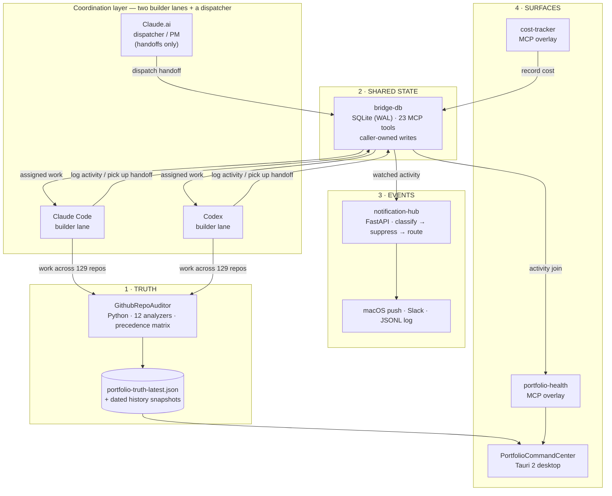

# Operator OS — A Multi-Agent Control Plane for a 129-Repo Portfolio

> A case study in turning portfolio sprawl into a single source of truth, and
> coordinating two autonomous coding agents against it without stepping on each
> other.

This document describes a working system — six local services plus a two-agent
coordination model — that I run over my own development portfolio. The metrics
below are pulled verbatim from a real `portfolio-truth-latest.json` snapshot
(schema `0.5.0`), not illustrative numbers.

---

## The problem: `git log` lies about your portfolio

If you ship fast and start often, you accumulate repositories faster than you can
remember them. The naive way to take inventory — walk every repo and read its
`git log` — answers the wrong question. A recent commit tells you *something
happened*; it does not tell you whether the project is **healthy, drifting,
blocked, or safe to ignore**.

Concretely, `git log` across 100+ repos can't answer:

- Which repos have **open high/critical security alerts** right now?
- Which ones are **ship-ready but haven't shipped**?
- Which have **tests and CI**, and which are one bad refactor from silent breakage?
- Which were last touched by **me**, by **Claude Code**, or by **Codex** — and is
  that drift expected?
- Which are genuinely **stale** versus merely quiet between releases?

A timestamp is a fact with no judgement attached. The portfolio needed a layer
that turns raw git/GitHub facts into a *graded, precedence-resolved, historical*
picture — one trustworthy artifact every other tool can consume. That artifact is
the spine of the whole system.

---

## The system: truth → state → events → surface

The Operator OS is five data services and one desktop shell, arranged as a
one-directional pipeline. Each layer has exactly one job and a clean contract with
the next.

### The components

| Layer | Component | Stack | One job |
|---|---|---|---|
| **Truth** | **GithubRepoAuditor** | Python 3.11+, SQLite history warehouse, Rich CLI | Scan every repo, run 12 analyzers, resolve a precedence matrix, emit one canonical `portfolio-truth-latest.json` + dated history. |
| **Shared state** | **bridge-db** | SQLite (WAL), MCP over stdio, FTS5 | Single store for cross-agent state: activity, handoffs, snapshots, cost, long-lived context. 23 tools; every write is ownership-gated by `caller`. |
| **Events** | **notification-hub** | Python 3.12, FastAPI, localhost-only | Turn agent/tool events into *routed* notifications: deterministic classify → dedup/quiet-hours/rate-limit suppress → deliver. |
| **Surface** | **PortfolioCommandCenter** | Tauri 2 (Rust shell) + React 18 + TS strict + Vite 6 | A signed desktop app that reads the truth snapshot read-only and renders the portfolio, weekly digest, and security burndown. |
| **Overlay** | **portfolio-health** | Python, MCP, SQLite FTS5 | Join project memory against bridge-db activity to answer "what's active / stale / ship-ready-but-unshipped." |
| **Overlay** | **cost-tracker** | Python, MCP, `ccusage` | Live agent spend: today, per-session, monthly trend, top projects, threshold alerts — persisted back into bridge-db. |

**Why this shape works:** the auditor is the *only* writer of truth, so every
surface agrees by construction. bridge-db is the *only* writer of shared agent
state, so two agents never disagree about who owns what. There is no shared
daemon — each MCP client spawns its own bridge-db process over stdio, and SQLite
WAL mode plus a busy-timeout makes concurrent writes safe without a coordinator.

---

## Real metrics from the truth snapshot

Every number here is read directly from the canonical
`portfolio-truth-latest.json` (schema `0.5.0`). It is regenerated on demand; this
is one real snapshot.

### Portfolio shape — 129 projects

| Dimension | Breakdown |
|---|---|
| **Total projects** | **129** (128 git repos, 1 non-git working dir) |
| **Activity status** | 22 recent · 90 active · 5 stale · 12 archived |
| **Lifecycle** | 108 active · 6 maintenance · 3 dormant · 12 archived |
| **Recency** | 91 repos touched in the last 7 days · 123 within 30 days · 127 within 90 days · median **4 days** since last meaningful activity |

The recency curve is the punchline: **only 2 of 129 repos** are older than 90 days.
This isn't a graveyard of abandoned projects — it's an actively churning portfolio,
which is *exactly* why a timestamp-only view is useless. Almost everything looks
"recent." The auditor's job is to grade what "recent" actually means.

### Health & risk

| Dimension | Breakdown |
|---|---|
| **Risk tier** | 62 baseline · 27 moderate · 28 elevated · 12 deferred |
| **Security risk** | **49 repos** carry at least one open high/critical security alert |
| **Tests present** | 103 / 129 (80%) |
| **CI present** | 83 / 129 (64%) |
| **License present** | 102 / 129 (79%) |
| **Context quality** | 68 minimum-viable · 29 standard · 16 full · 16 boilerplate |

That **49** is the single most valuable number the system produces and the one
`git log` can never give you: a precise, current count of repos with live
high/critical security exposure, ready to be burned down.

### Agent attribution — who built what

The truth file records a `tool_provenance` for each repo. Across 129 projects:

| Builder | Repos attributed |
|---|---|
| **Claude Code** | **53** |
| **Codex** | **23** |
| GPT (other) | 12 |
| Unknown / human-seeded | 41 |

**76 of 129 repos** are attributable to the two autonomous coding agents this
control plane coordinates. That coordination is the other half of the story.

---

## The coordination model: two agents, one control plane

Claude Code and Codex both write code across the same 129-repo portfolio. Left
uncoordinated, two autonomous agents on a shared filesystem are a merge-conflict
machine. The Operator OS keeps them out of each other's way with three rules.

### 1 · Lanes — ownership by area, enforced at the write boundary

Work is partitioned into **lanes**, and bridge-db enforces lane ownership at the
data layer: every write tool checks the `caller` and rejects writes to state the
caller doesn't own. The recognized writers are `cc` (Claude Code), `codex`,
`claude_ai`, and two ops services. A repo's build provenance, CI workflows, and
sync code belong to one lane; another agent reads them but does not mutate them.
The boundary is structural, not a polite convention — an agent *cannot* clobber
another lane's state even if it tries.

### 2 · Handoffs — a dispatcher hands work down, builders pick it up

The handoff protocol mirrors a PM-and-engineers org:

- **Claude.ai dispatches.** Only the `claude_ai` caller may `create_handoff` — it
  is the planning/PM seat and never writes code directly.
- **Builders pick up.** `cc` or `codex` calls `pick_up_handoff` to claim a unit of
  work, then `clear_handoff` when it's done.
- **State is shared, not messaged.** Handoffs live in bridge-db, so a builder
  starting a fresh session reads its assigned work from the store instead of
  needing the originating conversation. Context survives session boundaries.

### 3 · Push policy — feature branches, never `main`, merge server-side

The hard rule across every repo: **agents never push to `main`/`master`.** It's
enforced by a pre-tool hook, not trusted to the model. The workflow:

- Each unit of work happens on a **feature branch** (`docs/...`, `feat/...`,
  `fix/...`).
- Commits are small, conventional, and verified (compile + test) before they land.
- When a branch is ready, it merges through a **server-side merge** (e.g. a
  reviewed PR merge) rather than a local push to a protected branch — which also
  keeps the push-to-main guard satisfied without weakening it.
- Repos can carry **distinct push targets** (a public mirror vs. a private
  origin), so "where does this land" is per-repo, never assumed.

The result: two agents, hundreds of branches, zero pushes to protected branches,
and a truth layer that tells you — after the fact — exactly which agent touched
which repo.

---

## What this demonstrates

Beyond the portfolio itself, the build exercises a set of platform-engineering
patterns:

- **One-writer-per-fact architecture.** Truth has a single producer (the auditor);
  shared state has a single mutation path with ownership gating (bridge-db). Every
  consumer agrees by construction — no reconciliation logic anywhere downstream.
- **Contracts over coupling.** Layers communicate through versioned artifacts
  (`schema_version`) and typed load commands, so the desktop shell can render a
  snapshot it never has to understand how to compute.
- **Deterministic before probabilistic.** Notification urgency is decided by
  keyword rules and explicit policy, not an LLM call — fast, free, and auditable.
  The agents reason; the plumbing does not.
- **Safety enforced at the boundary, not requested politely.** No-push-to-main,
  caller-owned writes, localhost-only daemons, and secrets read from the OS
  keychain (never from repo files) are all structural guarantees.
- **Local-first and private by default.** Every service binds to loopback or runs
  over stdio. Nothing in this control plane requires a hosted backend.

---

## Component reference

| Component | Role in the pipeline | Interface |
|---|---|---|
| GithubRepoAuditor | Produces canonical portfolio truth + history | CLI, JSON/HTML/Markdown/Excel outputs |
| bridge-db | Shared cross-agent state | MCP (stdio), 23 tools, SQLite WAL |
| notification-hub | Event classification + routed delivery | Localhost HTTP intake + bridge file watcher |
| PortfolioCommandCenter | Desktop visualization of truth | Tauri 2 app, read-only truth consumer |
| portfolio-health | Active/stale/unshipped overlay | MCP (stdio), 5 tools, FTS5 |
| cost-tracker | Agent spend visibility | MCP (stdio), 6 tools, `ccusage` + bridge-db |

---

*Metrics in this document are drawn from a real `portfolio-truth-latest.json`
snapshot (schema 0.5.0). Paths are shown home-relative; this is a sanitized,
public write-up of a private local system.*
