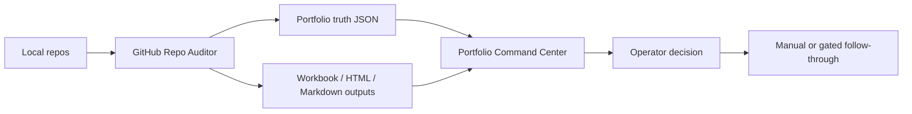

# Operator OS: A Multi-Agent Control Plane Over A Software Portfolio

Operator OS is a local-first control plane for AI-assisted builders: it turns a sprawling repo portfolio and multiple coding agents into verified truth, visible risk, and one operator-approved next move.

GitHub Repo Auditor is the truth engine behind the first public wedge. It began as a repository auditor, but the stronger product shape is a portfolio operating layer: one system that can say which projects are healthy, which are drifting, which are blocked, what changed, and what deserves attention next.

## Who This Is For

- Solo builders with dozens of repos and not enough trust in their own backlog.
- Staff engineers and technical leads who need decision-grade visibility across experimental, internal, and production projects.
- AI-native developers using Codex, Claude Code, ChatGPT, or similar tools across many workstreams.
- Devtools teams studying how agent-created work should be verified, prioritized, and governed.

## The Problem

AI coding tools make it easier to start and modify projects. They do not automatically make it easier to know what is true afterward.

Once a portfolio has enough projects and enough agent-touched work, normal tools flatten the wrong things:

- `git log` shows activity, not whether the work matters.
- GitHub alerts show risk, not which fix clears the most portfolio pain.
- Notes and handoffs preserve intent, but can drift from the current repo state.
- Agent transcripts are useful history, but they are not proof.
- Dashboards can look polished while hiding stale or private source data.

Operator OS starts from a stricter premise: local evidence wins. Every product surface should be traceable back to files, commands, generated artifacts, or explicit operator approval.

## Before And After

| Before | After |
| --- | --- |
| A long list of repos | A portfolio truth snapshot with risk, readiness, context quality, and security posture |
| Agent work scattered across chats | Agent provenance and follow-through visible in operator surfaces |
| Weekly review rebuilt from memory | Weekly command-center artifacts generated from current audit facts |
| Security alerts handled repo by repo | Advisory-grouped burndown showing the dependency bump that clears risk across repos |
| Handoffs as stale prose | Restart-safe handoffs that say what was checked, what must be rechecked, and what not to touch |
| Automation as blind trust | Dry-run-first proposals, explicit approvals, and evidence-backed execution gates |

## System Shape

The public wedge keeps this system deliberately narrow:

- `GithubRepoAuditor` produces portfolio truth and weekly/operator artifacts.
- `PortfolioCommandCenter` reads those artifacts and presents the operating view.
- Fixture or sanitized data drives the public demo.
- Private systems remain private implementation references, not public data sources.

The broader local machine adds other surfaces in private use:

- `bridge-db` for compact cross-agent receipts and state coordination.
- `personal-ops` for private inbox, planning, approvals, and local operator workflows.
- `notification-hub` for local event routing, review queues, and noise control.
- `SecondBrain` for private synthesized knowledge and source-grounded lessons.
- Codex and ChatGPT Pro workflow docs for advisory-only model review.

Those adjacent systems are useful because they prove the operating model under real pressure. They are not required for the public demo.

## What The Demo Shows

The public-safe demo should show the Portfolio Command Center running over fixture or sanitized portfolio truth:

1. A full portfolio table with risk, status, context quality, tool provenance, and security columns.
2. A risk/security tab that turns raw alert counts into portfolio-level attention.
3. A burndown tab that groups advisories by the fix that clears the most risk.
4. Trend charts that show whether risk is improving or getting worse.
5. A weekly digest that gives one headline, one decision, and one next move.

The private local proof package for the 2026-06-07 five-tab demo lives under `docs/demo-proof/2026-06-07/`. It proves the live local demo, but it is not the public publishing package because it may reveal real local portfolio details.

For public sharing, use the fixture-backed package under `docs/demo-proof/public-fixture/`.

## What Stays Private

The product should not expose raw local operating state. These surfaces are private by design:

- Local Codex sessions, memories, reports, hooks, secrets, config, and SQLite state.
- Gmail, Calendar, Drive, task, approval, and daemon state from `personal-ops`.
- Raw SecondBrain captures, conversation exports, vault history, and private notes.
- Real Notion databases, project rows, tokens, API traces, and live write receipts.
- `bridge-db` live SQLite contents, handoffs, snapshots, receipts, recall logs, and activity rows.
- `notification-hub` events, Slack routing, local queue state, and review logs.
- Private repo names, local absolute paths, branch state, and security findings unless they are intentionally sanitized.

The productizable asset is the pattern: local truth, bounded context, visible provenance, approval gates, and operator-facing decisions.

## Why It Is Hard To Copy

The moat is not a chart. Charts are easy.

The hard part is the lived-in operating discipline:

- One canonical truth contract feeding multiple views.
- Generated artifacts that agree with each other instead of becoming separate stories.
- Dry-run-first action flows that preserve human approval.
- Explicit stale-state handling instead of cheerful lies.
- Agent role boundaries: advisory models advise; local agents verify and execute.
- Restart-safe handoffs that force the next session back to current evidence.
- Private-by-default local operation with public-safe fixture demos.

Most products start with a dashboard and bolt trust on later. Operator OS starts with trust and lets the dashboard expose it.

## Public Wedge

The first wedge is Portfolio Command Center:

- simple enough to demo in 90 seconds;
- grounded in concrete repo facts;
- visually understandable to developers immediately;
- impressive without needing private email, calendar, Notion, or agent transcripts;
- extensible into the broader Operator OS story.

## Demo Links

- [90-second demo plan](DEMO-PLAN.md)
- [Fixture demo source](fixtures/demo/sample-report.json)
- [Public fixture proof package](docs/demo-proof/public-fixture/README.md)
- [Private local demo proof package](docs/demo-proof/2026-06-07/README.md)
- [Portfolio Command Center](../PortfolioCommandCenter/README.md)
